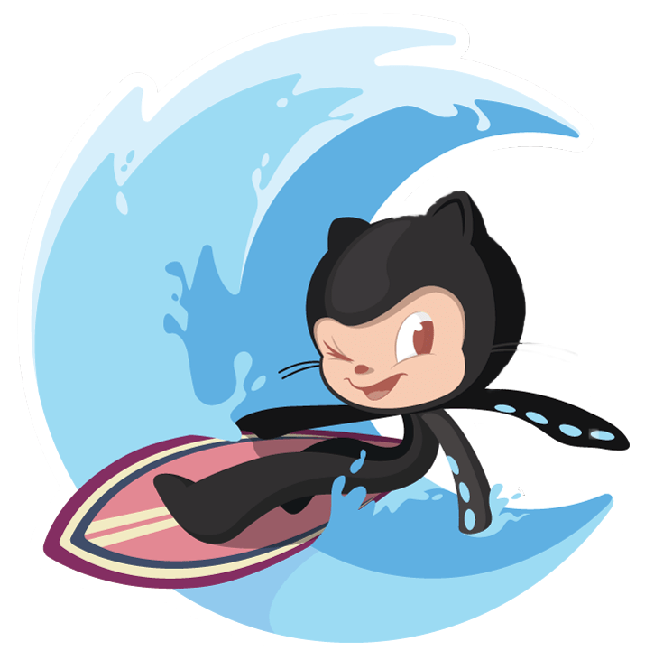

  

<h2 align="center">
  GitHub Structure
</h2>

List organising all my repos and projects.

## Rocketseat
Repository for projects I understood and can reproduce, created while studying at the programming school Rocketseat.

### Root
- [Rocketseat](https://github.com/diegommagno/rocketseat)
- [Explorer](https://github.com/diegommagno/rocketseat/tree/main/explorer)
- [Ignite](https://github.com/diegommagno/rocketseat/tree/main/ignite)

### Events
##### Ignite Lab
- [Events Platform](https://github.com/diegommagno/rocketseat/tree/main/events/ignite-lab/events-platform)
- [Design System](https://github.com/diegommagno/ignite-lab-design-system)

##### Explorer Lab
- [RocketPay](https://github.com/diegommagno/rocketseat/tree/main/events/explorer-lab/rocketpay)
- [RocketPay pt-br](https://github.com/diegommagno/explorer-lab-rocketpay)
- [RocketPay en](https://github.com/diegommagno/explorer-lab-rocketpay-en)

##### Explorer Marathon
- [Crystal Ball](https://github.com/diegommagno/rocketseat/tree/main/events/explorer-marathon/explorer-marathon-01/crystal-ball)
- [RocketLinks](https://github.com/diegommagno/rocketseat/tree/main/events/explorer-marathon/explorer-marathon-02/rocketlinks)
- [RocketCoffee](https://github.com/diegommagno/rocketseat/tree/main/events/explorer-marathon/explorer-marathon-03/rocketcoffee)

##### boracodar.dev
- [01 - Music Player](https://github.com/diegommagno/rocketseat/tree/main/events/boracodar.dev/01-music-player)
- [02 - Product Card](https://github.com/diegommagno/rocketseat/tree/main/events/boracodar.dev/02-product-card)

##### DevLinks
- [DevLinks](https://github.com/diegommagno/rocketseat/tree/main/events/devlinks)

##### Next Level Week
- [NLW World Cup - Games Calendar](https://github.com/diegommagno/rocketseat/tree/main/events/next-level-week/2022/nlw-copa/explorer)
- [NLW World Cup - Card](https://github.com/diegommagno/rocketseat/tree/main/events/next-level-week/2022/nlw-copa/card/pt-br)
- [NLW eSports Explorer - Games](https://github.com/diegommagno/rocketseat/tree/main/events/next-level-week/2022/nlw-esports/explorer)
- [NLW eSports Explorer - Cinema](https://github.com/diegommagno/rocketseat/tree/main/events/next-level-week/2022/nlw-esports/explorer/challenge/en)
- [NLW Return Origin - DoctorCare](https://github.com/diegommagno/rocketseat/tree/main/events/next-level-week/2022/nlw-return/origin)

 

### Explorer Course

#### Root
- [Explorer](https://github.com/diegommagno/rocketseat/tree/main/explorer)

#### Stages

##### Stage 02

- [Project 01 - Furniture Store](https://github.com/diegommagno/rocketseat/tree/main/explorer/stage-02/furniture-store/pt-br)
- [Project 02 - Rocket.sect](https://github.com/diegommagno/rocketseat/tree/main/explorer/stage-02/rocket-sect/pt-br)
- [Project 03 - Train.me](https://github.com/diegommagno/rocketseat/tree/main/explorer/stage-02/train-me)

##### Stage 03

- [Project 01 - Create Your Event Form](https://github.com/diegommagno/rocketseat/tree/main/explorer/stage-03/create-your-event-form)
- [Project 02 - Mentorship Form](https://github.com/diegommagno/rocketseat/tree/main/explorer/stage-03/mentorship-form)
- [Project 03 - Mentorship Feedback Form](https://github.com/diegommagno/rocketseat/tree/main/explorer/stage-03/mentorship-feedback-form)
- [Project 04 - Mobile first project](https://github.com/diegommagno/rocketseat/tree/main/explorer/stage-03/responsive)
- [Project 05 - Space Cream Mobile](https://github.com/diegommagno/rocketseat/tree/main/explorer/stage-03/advanced-css/space-cream)
- [Project 06 - Space Cream Mobile first](https://github.com/diegommagno/rocketseat/tree/main/explorer/stage-03/advanced-css/space-cream)
- [Project 07 - Portfolio Cards](https://github.com/diegommagno/rocketseat/tree/main/explorer/stage-03/advanced-css/portfolio-cards)

##### Stage 04

- [Project 01 - JavaScript Challenge 01](https://github.com/diegommagno/rocketseat/tree/main/explorer/stage-04/desafio-01)
- [Project 02 - JavaScript Challenge 02](https://github.com/diegommagno/rocketseat/tree/main/explorer/stage-04/desafio-02)

##### Stage 05

- [Project 01 - Guessing Game](https://github.com/diegommagno/rocketseat/tree/main/explorer/stage-05/jogo-adivinhacao)
- [Project 02 - Calculate BMI](https://github.com/diegommagno/rocketseat/tree/main/explorer/stage-05/calcular-imc)
- [Project 03 - ES Modules](https://github.com/diegommagno/rocketseat/tree/main/explorer/stage-05/es-modules)
- [Project 04 - Calculate BMI (applying Modules)](https://github.com/diegommagno/rocketseat/tree/main/explorer/stage-05/calcular-imc/calcular-imc-modules)
- [Project 05 - FocusTimer](https://github.com/diegommagno/rocketseat/tree/main/explorer/stage-05/focustimer)
- [Project 06 - FocusTimer 2.0](https://github.com/diegommagno/rocketseat/tree/main/explorer/stage-05/focustimer-2)

##### Stage 06

- [Project 01 - SPA Concepts](https://github.com/diegommagno/rocketseat/tree/main/explorer/stage-06/spa-concepts)
- [Project 02 - SPA Universe](https://github.com/diegommagno/rocketseat/tree/main/explorer/stage-06/spa-universe)

 

### Ignite Bootcamp
#### Root
- [Ignite](https://github.com/diegommagno/rocketseat/tree/main/ignite)

 

### Discover
#### Root
- [Discover](https://github.com/diegommagno/rocketseat/tree/main/discover)

 

---

## Business
Repository for commercial projects.

- afsaude.com.br [private repo](https://github.com/diegommagno/business-afsaude.com.br) 𒑰 [live preview](https://afsaude.com.br/) 
- cemianko.ink [private repo](https://github.com/diegommagno/business-cemianko.ink)
- nutrilazarini.com.br [private repo](https://github.com/diegommagno/business-lazarini)

 

---
## Ocean Labs
Repositories for public and private projects.

### Root
- [Ocean Labs](https://github.com/diegommagno/ocean-labs)
- [Ocean Labs Private](https://github.com/diegommagno/ocean-labs-private)

#### Websites
- [Apple](https://github.com/diegommagno/ocean-labs/tree/main/main/websites/apple)
- [Sushi](https://github.com/diegommagno/ocean-labs/tree/main/main/websites/sushi)

 

### Components
#### Dropdowns
- [dropdown-1](https://github.com/diegommagno/ocean-labs/tree/main/main/components/dropdowns/dropdown-1)

#### Navigation bars
##### JavaScript
- [navbar-1](https://github.com/diegommagno/ocean-labs/tree/main/main/components/navigation-bars/javascript/navbar-1)
- [navbar-2](https://github.com/diegommagno/ocean-labs/tree/main/main/components/navigation-bars/javascript/navbar-2)

 

### Origamid
##### Projects
- [Calculator](https://github.com/diegommagno/ocean-labs/tree/main/main/origamid/events/calculator)

 

---
## Others

- diegommagno.com [private repo](https://github.com/diegommagno/diegommagno.com) 𒑰 [live preview](http://diegommagno.com/) 
- qualityUpdate [private repo](https://github.com/diegommagno/qualityUpdate)
- qualityphysio.co.uk [private repo](https://github.com/diegommagno/qualityphysio.co.uk)
- [devExplorer](https://github.com/diegommagno/devexplorer)
- [advanced-css-course](https://github.com/diegommagno/advanced-css-course)
- [links](https://github.com/diegommagno/Links)
- [css-animations-playlist](https://github.com/diegommagno/css-animations-playlist)
- [Descalvado-Hotel](https://github.com/diegommagno/Descalvado-Hotel)
- [coursera-fullstack-course](https://github.com/diegommagno/coursera-fullstack-course)
- [coursera-fullstack-course-lectures](https://github.com/diegommagno/coursera-fullstack-course-lectures)

 
